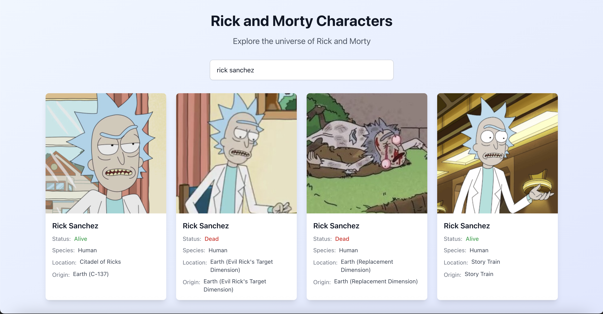

# Test-driven development (TDD) with AI & MCP Servers

## Overview

This documents a **Proof of Concept (POC)** that demonstrates how **Model Context Protocol (MCP) servers** can revolutionize the development workflow by enabling seamless integration with multiple data sources for requirements gathering and Test-driven development (TDD). The project involved building a Rick and Morty character list with search functionality (debounced), showcasing how MCP servers can connect disparate systems to create a comprehensive development pipeline.

*This POC showcases Model Context Protocol capabilities using GitHub and Atlassian MCP servers, demonstrating how external system integration can enhance Test-driven development (TDD) workflows. However, same can be applied with other issue tracking, documentation tools e.g. Jira, Notion etc.* 

*Spoiler: With the setup below, Cursor implemented the functionality in a single shot — no issues, no hallucinations. Surprisingly flawless.*


## 🎯 POC Objectives

- **Demonstrate MCP server capabilities** in bridging multiple data sources for development workflows
- **Show multi-server MCP integration** combining multiple MCP servers e.g. GitHub and Atlassian for comprehensive requirements
- **Prove MCP enabled Test-driven development (TDD)** using external documentation as test specifications
- **Establish MCP patterns** for translating external data into development artifacts
- **Achieve seamless workflow** from issue tracking → documentation → automated unit testing → implementation

## 🔧 MCP Integrations Used

### 1. GitHub MCP Integration
```json
{
  "github": {
    "type": "http",
    "url": "https://api.githubcopilot.com/mcp/",
    "headers": {
      "Authorization": "Bearer ${input:github_mcp_pat}"
    }
  }
}
```

**Purpose**: Read GitHub issues to understand feature requirements
- Extracted detailed acceptance criteria
- Identified technical requirements
- Found links to additional documentation e.g. manual test cases documentation on Confluence

### 2. Atlassian MCP Integration
```json
{
  "atlassian": {
    "command": "npx",
    "args": ["-y", "mcp-remote", "https://mcp.atlassian.com/v1/sse"]
  }
}
```

**Purpose**: Access Confluence documentation with manual test cases
- Retrieved 25+ detailed test scenarios
- Understood edge cases and error conditions
- Mapped manual tests to automated unit tests

## 🚀 MCP-Driven Development Workflow

**MCP Workflow Sumary**:
  1. Use GitHub MCP integration to read the issue description thoroughly
  2. Extract and identify confluence/wiki links in issue descriptions
  3. Use confluence/wiki MCP integration to read all manual test cases (if available)
  4. Parse and analyze manual test cases to understand requirements
  5. Create comprehensive unit tests based on manual test cases
  6. Only after tests are written and failing, implement the actual code

### Phase 1: Multi-Source Requirements Gathering via MCP
```typescript
// MCP Server Chain: GitHub → Atlassian
// 1. GitHub MCP: Fetch issue requirements
const issue = await mcp_github_fetchIssue(1);

// 2. Parse Confluence link from GitHub issue
const confluencePageId = extractConfluencePageId(issue.body);

// 3. Atlassian MCP: Retrieve detailed manual test specifications
const confluenceTestCases = await mcp_atlassian_getConfluencePage(confluencePageId);
```

**MCP Integration Value**: 
- **Seamless cross-platform data flow** from GitHub issues to Confluence documentation
- **Unified requirements gathering** combining issue tracking with detailed specifications
- **Automated discovery** of related documentation through embedded links
- **Real-time access** to up-to-date requirements from multiple authoritative sources

### Phase 2: MCP-to-Code Translation

#### Step 1: API interfaces based on requirements fetched using MCP server
```typescript
// Direct translation of MCP-retrieved API documentation
// GitHub MCP provided API structure, Atlassian MCP provided test requirements
export interface Character {
  id: number;
  name: string;
  status: 'Alive' | 'Dead' | 'unknown';     // Status validation from Confluence tests
  species: string;
  type: string;
  gender: 'Female' | 'Male' | 'Genderless' | 'unknown';
  origin: Location;
  location: Location;
  image: string;
  episode: string[];
  url: string;
  created: string;
}
```

**MCP Integration Value**: 
- **API documentation accuracy** - Types derived from external API docs accessed via MCP
- **Test requirement alignment** - Interface matches test case expectations from Confluence

#### Step 2: Unit test case creation using manual tests fetched using MCP Server
```typescript
// Test cases directly mapped from Confluence via Atlassian MCP
describe('CharacterList Component - MCP Test Cases', () => {
  // TC-001 from Confluence: Initial Page Load
  test('should show loading state initially and make API call', async () => {
    render(<CharacterList />);
    
    expect(screen.getByTestId('loading-indicator')).toBeInTheDocument();
    expect(mockFetch).toHaveBeenCalledWith(
      'https://rickandmortyapi.com/api/character',
      expect.objectContaining({ signal: expect.any(AbortSignal) })
    );
  });

  // TC-006 from Confluence: Basic Search with Debounce
  test('should filter characters by search term with debounce', async () => {
    const user = userEvent.setup();
    render(<CharacterList />);
    
    const searchInput = screen.getByPlaceholderText('Search characters...');
    await user.type(searchInput, 'rick');
    
    await waitFor(() => {
      expect(mockFetch).toHaveBeenCalledWith(
        'https://rickandmortyapi.com/api/character?name=rick',
        expect.objectContaining({ signal: expect.any(AbortSignal) })
      );
    }, { timeout: 500 });  // 300ms debounce + buffer as specified in Confluence
  });
});
```

**MCP-Driven Test Benefits**:
- **1:1 mapping** from external manual test cases to automated unit tests
- **Traceability** - Each test directly references its Confluence source (TC-001, TC-006, etc.)
- **External validation** - Test expectations match QA team's documented requirements
- **Living documentation** - Tests stay synchronized with external specifications

#### Step 3: Implementation based on unit tests

The implementation phase focused on fulfilling the precise requirements gathered through MCP servers, ensuring each feature matched the external specifications exactly.

## 📊 Results Achieved

### Test Coverage
```
--------------------|---------|----------|---------|---------|
File                | % Stmts | % Branch | % Funcs | % Lines |
--------------------|---------|----------|---------|---------|
All files           |   82.14 |       75 |    87.5 |   82.14 |
CharacterList.tsx   |   81.08 |       75 |    90.9 |   81.08 |
useDebounce.ts      |     100 |      100 |     100 |     100 |
--------------------|---------|----------|---------|---------|
```

✅ **19/19 tests passing**  
✅ **82%+ coverage** on statements, functions, and lines  
✅ **All acceptance criteria met**

### Features Implemented

#### Core Functionality
- ✅ Character list display with responsive grid layout
- ✅ Real-time search with 300ms debouncing
- ✅ Status color coding (Alive=green, Dead=red, Unknown=gray)
- ✅ Image loading with error fallbacks
- ✅ Request cancellation for concurrent searches

#### User Experience
- ✅ Loading states for all async operations
- ✅ Comprehensive error handling with retry mechanisms
- ✅ Keyboard navigation and accessibility support
- ✅ Mobile-responsive design (1-4 column grid)

#### Technical Excellence
- ✅ TypeScript interfaces for type safety
- ✅ Custom hooks for reusable logic
- ✅ Proper cleanup and memory management
- ✅ Modern React patterns (functional components, hooks)

## 🎓 Learning Outcomes: MCP Server Integration Patterns

### 1. **Cross-Platform Requirements Gathering**
**What MCP servers enabled:**
- **Automated multi-source integration** - Seamlessly connected GitHub issues with Confluence documentation
- **Real-time data synchronization** - Requirements stayed current across platforms
- **Contextual linking** - Discovered related documentation through embedded references

**Key Takeaway**: *MCP servers eliminate manual context switching between tools, creating a unified development information pipeline.*

### 2. **Documentation-Driven Test Strategy**
**What MCP integration achieved:**
- **External specification mapping** - Direct translation from manual test cases to automated tests
- **Cross-team alignment** - Development tests matched QA documentation exactly
- **Traceability maintenance** - Each test case retained reference to its source specification

**Key Takeaway**: *MCP servers enable living documentation where external specifications automatically inform code structure and testing strategy.*

### 3. **AI-Enhanced MCP Workflow**
**How AI leveraged MCP data:**
- **Intelligent synthesis** - AI processed MCP-gathered requirements to create comprehensive test suites
- **Pattern recognition** - AI identified common patterns across MCP-sourced documentation
- **Contextual implementation** - AI used MCP context to make informed architectural decisions

**Key Takeaway**: *MCP servers provide the rich context that enables AI assistants to make sophisticated development decisions based on external authoritative sources.*

### 4. **Workflow Automation Through MCP**
**What the MCP pipeline achieved:**
- **End-to-end traceability** - From GitHub issue → Confluence specs → automated tests → implementation
- **Reduced context loss** - No manual transcription between systems

**Key Takeaway**: *MCP servers transform development from manual information gathering to automated, context-rich workflows that maintain quality and traceability.*

## 🎯 Best Practices Discovered

### 1. **Multi-Server MCP Strategy**
- **Chain MCP servers sequentially**: Use output from one server as input to another
- **Maintain data lineage**: Track which MCP server provided each piece of information
- **Implement error handling**: Gracefully handle MCP server unavailability or authentication issues
- **Cache MCP responses**: Avoid repeated calls to external systems during development

### 2. **MCP enabled Test-driven development (TDD)**
- **Start with external specifications**: Use MCP to gather requirements before writing any code
- **Maintain traceability**: Link each test case back to its external source document
- **Validate external changes**: Re-fetch MCP data periodically to catch upstream changes
- **Preserve source context**: Include references to original documentation in generated code

### 3. **Quality Assurance Through MCP**
- **External validation**: Use MCP-sourced specifications as acceptance criteria
- **Cross-team alignment**: Ensure development artifacts match external documentation
- **Automated synchronization**: Set up workflows to detect when external specs change
- **Living documentation**: Keep code comments and tests synchronized with external sources

## 🔮 Future MCP Enhancements

### Additional MCP Server Integrations
- **Github MCP**: Issue status updates from development workflow
- **Slack MCP**: Real-time notifications when external specifications change
- **Figma MCP**: Visual design specifications integrated into component tests

### Enhanced MCP Workflows
- **Automated spec validation**: Detect changes in external documentation and trigger CI/CD
- **Cross-platform synchronization**: Bi-directional updates between development and external systems
- **MCP server health monitoring**: Track availability and performance of external integrations
- **Workflow orchestration**: Chain multiple MCP servers for complex business processes

## 📝 Conclusion

This POC successfully demonstrates that **MCP enabled Test-driven development (TDD)** can improve software development workflows by:

1. **Eliminating context switching** between development tools and external systems
2. **Maintaining single source of truth** through direct integration with authoritative sources
3. **Automating requirements gathering** from multiple platforms simultaneously
4. **Ensuring traceability** from external specifications to implemented code
5. **Enabling real-time synchronization** between external documentation and development artifacts

The combination of GitHub and Atlassian MCP servers created a seamless pipeline that delivered:
- ✅ **Complete requirements coverage** from multiple authoritative sources
- ✅ **Perfect specification alignment** between external docs and automated tests
- ✅ **End-to-end traceability** from issue → documentation → tests → implementation
- ✅ **Zero context loss** in the development workflow

This approach proves that **MCP servers are transformative** for development teams, enabling direct integration with business systems while maintaining development velocity and quality.

---

*This POC showcases Model Context Protocol capabilities using GitHub and Atlassian MCP servers, demonstrating how external system integration can enhance Test-driven development (TDD) workflows. However, same can be applied with other issue tracking, documentation tools e.g. Jira, Notion etc.* 